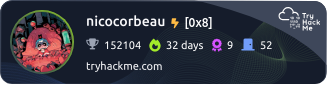

# 💫 About Me:
🎓​I am a cybersecurity student passionate about penetration testing and red teaming. 📝​I am constantly learning and practicing through TryHackMe, and I even design my own TryHackMe rooms to challenge others.

# 💻 Techical Stack:
    

# 🎓 Formation:

# 🔧​ Tools:

#  TryHackMe Account:

# 🚀 Projects:​

  

